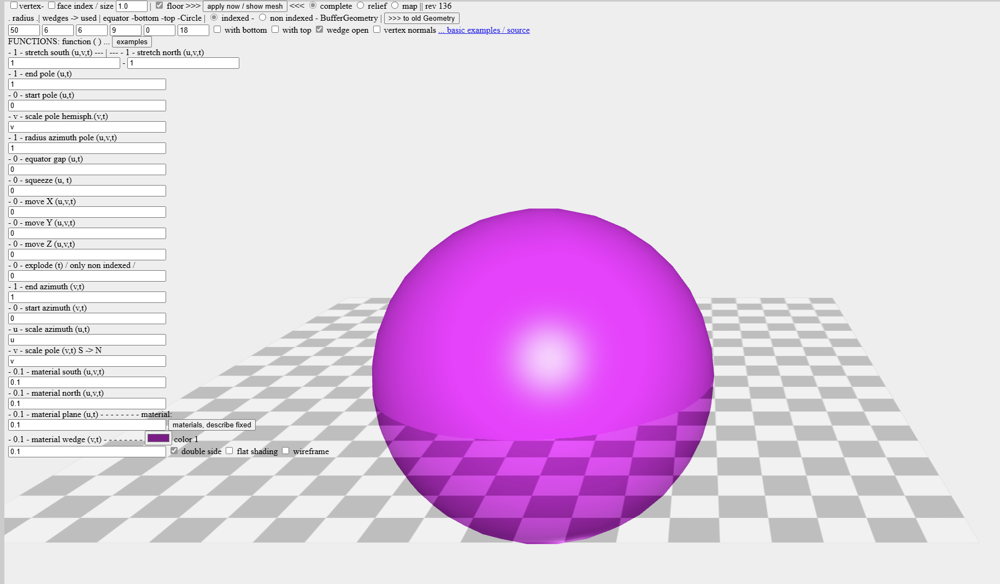

# Entry 4
##### 03/15/2026

## Progress Check 
It's been a month since my last blog, and since then I have made a fair amount of progress. I offically started working on my project. Though I am nowhere near done researching my tool, it was time to start the project, and I figured that I can just reserach along the way. 

In terms of my knowledge of [three.js](https://threejs.org/) I would say that I know enough to get started. With the knowledge that I have of my tool, I believe that I can reach an MVP of my project, or at least almost get there. If I wanted to add details and fully create my project as throughly as my plan that I made in the beginning of the year, I would have to spend more time researching my tool, but as I said earlier, I can just do that along the way. 

## What I learned Since the Last Blog
Since the last blog I tinkered with my tool quite a bit before I started my project, though the tinkering that I did this time correlates directly to my project, hence I plan to use this code from tinkering onto my actual project.

The code that I tinkered was learning how to make a half sphere. The reason why I wanted to learn how to make a half sphere, is because the diagrams of animal cells are typically depicted to be a half sphere, for example: 


The image above is what I plan to use a refrence going forward, when it comes to the _structure_ of my model using three.js. 

Here is my **attempt** ad coding a half sphere using three.js:

``` JS
new THREE.SphereGeometry(radius, widthSegments, heightSegments, phiStart, phiLength, thetaStart, thetaLength)
const radius = 5;
const widthSegments = 32; 
const heightSegments = 16;
const phiStart = 0; 
const phiLength = Math.PI * 2; 
const thetaStart = 0; 
const thetaLength = Math.PI / 2;
const material = new THREE.MeshBasicMaterial({
    color: 0x00ff00,
    side: THREE.DoubleSide 
});

const halfSphere = new THREE.Mesh(geometry, material);
scene.add(halfSphere);
const radius = 5;
const radialSegments = 32;

const hemiSphereGeom = new THREE.SphereGeometry(radius, radialSegments, Math.round(radialSegments / 4), 0, Math.PI * 2, 0, Math.PI / 2);

const capGeom = new THREE.CircleGeometry(radius, radialSegments);
capGeom.rotateX(Math.PI * 0.5); 

const material = new THREE.MeshStandardMaterial({ color: "blue", side: THREE.DoubleSide });

const hemiSphereMesh = new THREE.Mesh(hemiSphereGeom, material);
const capMesh = new THREE.Mesh(capGeom, material);

const solidHemisphere = new THREE.Group();
solidHemisphere.add(hemiSphereMesh);
solidHemisphere.add(capMesh);

scene.add(solidHemisphere);
```

As you can see above the code looks _extremely_ complicated, therefore in order to understand it more, I used the _**three.js forum**_ to help explain the code to me and to see if other people did the code in much simpler ways.

From it I found a [three.js sandbox](https://hofk.de/main/threejs/sandboxthreep/), the sandbox allowed me to test out different dimensions, and more functions on how to code the sphere for example:



As you can see above the sandbox, breaks down the code into diffent inputs so you can take the time to understand what each piece of code does, which is what I spent much of my time doing. 

## Offically Starting the Project
On our next freedom Monday Mr. Mueller told us that we had to offically start coding the project. Though there was one step before we can start hands on coding, which is making a _plan_ for our MVP.

I decided that my MVP would have the basic information of what an animal cell should therefore I decided to make my MVP plan based on that thought process.

### MVP Plan

* **Deadline** - 03/02/2026
- [ ] Create a scene
  - [ ] Uses DOM (concept 1)
    - [ ] `document.body.appendChild()` 
- [ ] Make a base model for the animal cell 
  - [ ] make it into a spherical shape
  - [ ] base color of the base
    - [ ] hex code: #5d9aa8
  - [ ] set up camera + rotation of the basic model
    - [ ] uses function (concept 2)

* **Deadline** - 03/16/2026
- [ ] Make the cell membrane
  - [ ] another spherical shape within the bigger one
    - [ ] make only the radius of it show
  - [ ] hex code: #3e6b75
- [ ] Create two more organelles (all uses spherical shapes) 
  - [ ] Nucleus (hex code: #3e5175)
    - [ ] if possible create the nucleolus and nuclear membrane 
  - [ ] vaculoes (hex code: #96b1e3)
     
* **Deadline** - 04/06/2026
- [ ] Finish rest of the MAIN organelles
  - [ ] mitochondrian
  - [ ] smooth endoplasmic reticulum
  - [ ] rough endoplasmic reticulum
  - [ ] lysosome
  - [ ] cytoplasm 

#### Beyond MVP
- [ ] Clickable organelles 
  - [ ] explains the function of those organelle
- [ ] Looping animations demonstrating the process of the organelles within the cell
- [ ] Plant cell model
  - [ ] linking page to the animal cell model (easy to go back and forth)
  - [ ] clickable organelles
    - [ ] explains the functions of those organelles
- [ ] Adding detail to the organelles that were already created
  - [ ] more shapes within the shapes
- [ ] organize the organelles within an array (concept 3)
- [ ] make a background, so the cell model can pop out more and be more visual appealing 

As you can see above I ended up making a quite detailed and thoughtout plan, though I had one issue. Orginally I had a good pacing when it comes to following my plan until...

## Challenges 
As I was coding I was able to get the basic setup down. I then tried to code some testing shapes to ensure that my code works and appears fine, but then when I pressed `http-server`, nothing would come up. 

[Previous](entry03.md) | [Next](entry05.md)

[Home](../README.md)
