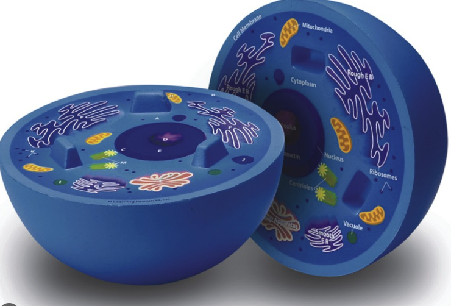

# Entry 4
##### 03/15/2026

## Progress Check 
It's been a month since my last blog, and since then I have made a fair amount of progress. I offically started working on my project. Though I am nowhere near done researching my tool, it was time to start the project, and I figured that I can just reserach along the way. 

In terms of my knowledge of [three.js](https://threejs.org/) I would say that I know enough to get started. With the knowledge that I have of my tool, I believe that I can reach an MVP of my project, or at least almost get there. If I wanted to add details and fully create my project as throughly as my plan that I made in the beginning of the year, I would have to spend more time researching my tool, but as I said earlier, I can just do that along the way. 

## What I learned Since the Last Blog
Since the last blog I tinkered with my tool quite a bit before I started my project, though the tinkering that I did this time correlates directly to my project, hence I plan to use this code from tinkering onto my actual project.

The code that I tinkered was learning how to make a half sphere. The reason why I wanted to learn how to make a half sphere, is because the diagrams of animal cells are typically depicted to be a half sphere, for example: 


The image above is what I plan to use a refrence going forward, when it comes to the _structure_ of my model using three.js. 

Here is my **attempt** ad coding a half sphere using three.js:

``` JS
new THREE.SphereGeometry(radius, widthSegments, heightSegments, phiStart, phiLength, thetaStart, thetaLength)
const radius = 5;
const widthSegments = 32; 
const heightSegments = 16;
const phiStart = 0; 
const phiLength = Math.PI * 2; 
const thetaStart = 0; 
const thetaLength = Math.PI / 2;
const material = new THREE.MeshBasicMaterial({
    color: 0x00ff00,
    side: THREE.DoubleSide 
});

const halfSphere = new THREE.Mesh(geometry, material);
scene.add(halfSphere);
const radius = 5;
const radialSegments = 32;

const hemiSphereGeom = new THREE.SphereGeometry(radius, radialSegments, Math.round(radialSegments / 4), 0, Math.PI * 2, 0, Math.PI / 2);

const capGeom = new THREE.CircleGeometry(radius, radialSegments);
capGeom.rotateX(Math.PI * 0.5); 

const material = new THREE.MeshStandardMaterial({ color: "blue", side: THREE.DoubleSide });

const hemiSphereMesh = new THREE.Mesh(hemiSphereGeom, material);
const capMesh = new THREE.Mesh(capGeom, material);

const solidHemisphere = new THREE.Group();
solidHemisphere.add(hemiSphereMesh);
solidHemisphere.add(capMesh);

scene.add(solidHemisphere);
```

As you can see above the code looks _extremely_ complicated, therefore in order to understand it more, I used the _**three.js forum**_ to help explain the code to me and to see if other people did the code in much simpler ways.

From it I found a [three.js sandbox](https://hofk.de/main/threejs/sandboxthreep/), the sandbox allowed me to test out different dimensions, and more functions on how to code the sphere for example:


[Previous](entry03.md) | [Next](entry05.md)

[Home](../README.md)
